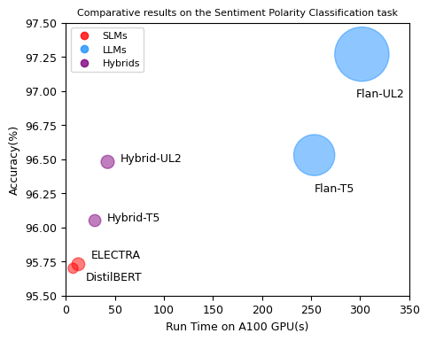
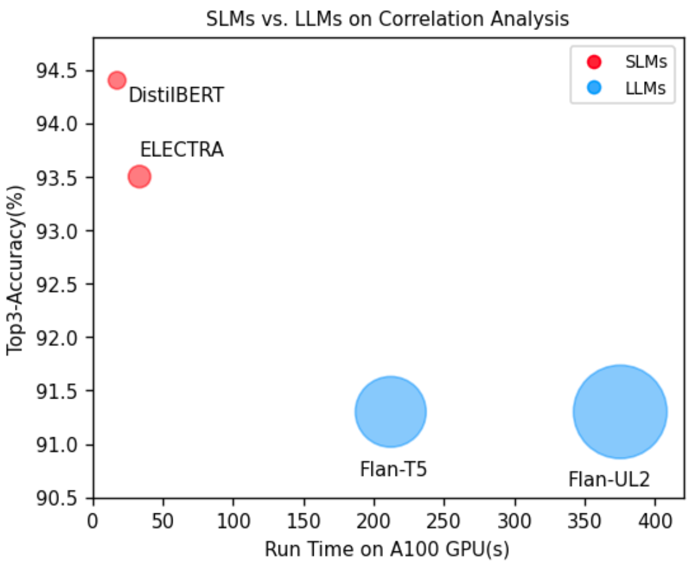

# A Comparative Study of SLMs and LLMs in Customer Review Analysis
[[Poster of this work]](/poster.pdf)

## Overview
This study conducts a comprehensive comparison of the performance trade-offs between Small Language Models (SLMs) and Large Language Models (LLMs) on two critical tasks in customer review analysis: **sentiment polarity classification** and **correlation analysis with product categories**. 

- Selected SLMs: DistilBERT, ELECTRA
- Selected LLMs: Flan-T5, Flan-UL2
- Dataset: [Amazon US Customer Reviews Dataset](https://www.kaggle.com/datasets/cynthiarempel/amazon-us-customer-reviews-dataset/data)

To address these tasks, we employed three distinct methods on each task: 
1. Utilizing SLMs; 
2. Utilizing LLMs; 
3. Deploying hybrid methods. 

Hybrid System on Sentiment Polarity Classification

Methods on Correlation Analysis

## Results
Our findings reveal that while LLMs excel in sentiment polarity classification by outperforming SLMs in accuracy, they come with significantly higher computational costs. Conversely, SLMs demonstrate superior performance and efficiency for the more domain-specific task of correlation analysis. To balance accuracy and efficiency in sentiment polarity classification, we further propose a hybrid system integrating SLMs and LLMs through a tiered processing strategy.

Comparative Results of Sentiment Polarity Classification Task

Comparative Results of Correlation Analysis Task

